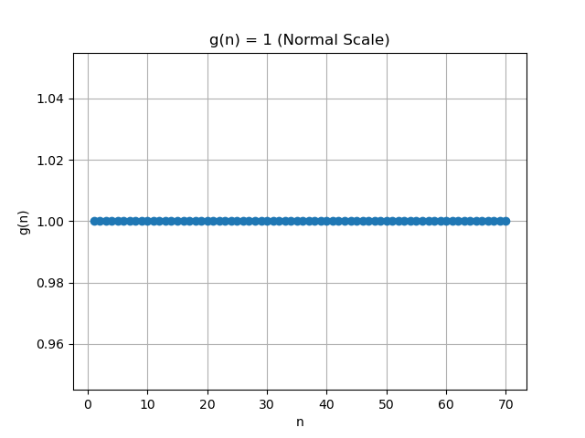
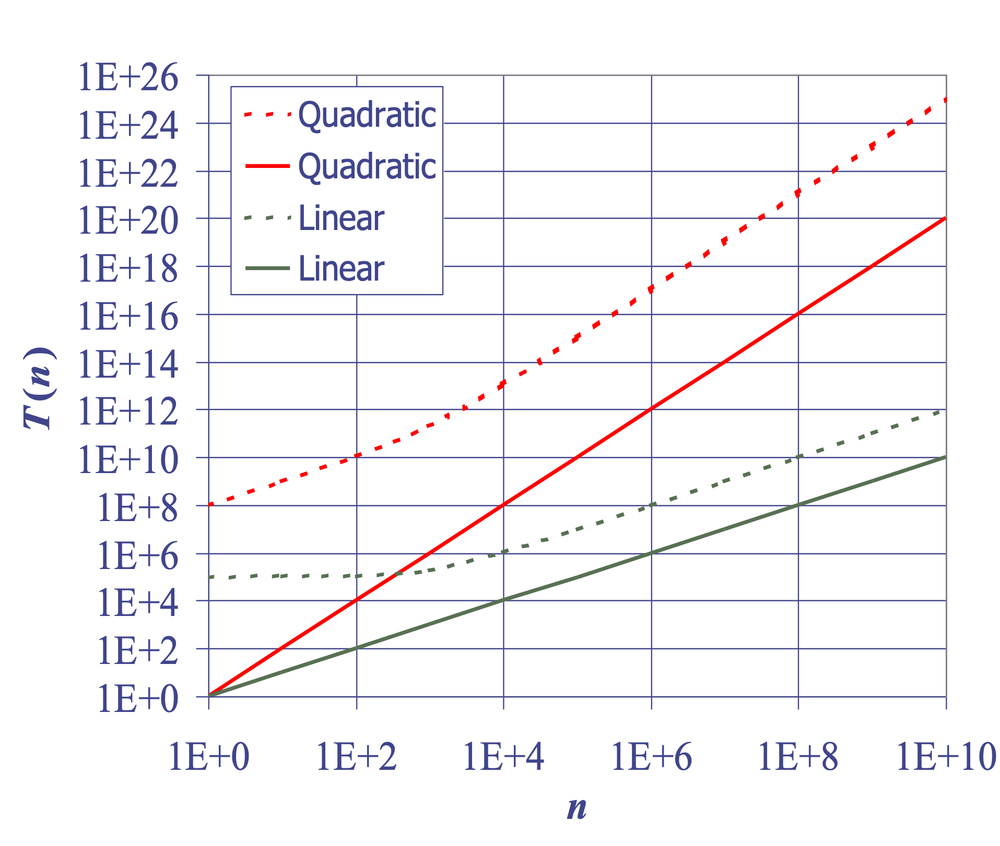

<!-- =========================================
     TITLE SLIDE (No Book Bind)
     ========================================= -->
<section>

  <!-- Main white paper w/ lines -->
  

    

  

  <!-- Title in the center -->
  

    <h1>CSE 431/531 Algorithm Analysis and Design</h1>
  

  <!-- Bigger sticky note for the subtitle (bottom-left) -->
  

    <h2>Analysis of Algorithms </h2>
  

  <!-- “Hello My Name Is” sticker at top-right -->
  

    

      HELLO
       
      MY NAME IS
    

    

      Jue Guo
       
      University at Buffalo, SUNY
    

  

</section>

---

<!-- =========================================
     SLIDE: Understanding Scale
     ========================================= -->

  ## Understanding Scale

  

  <!-- Left Column -->
  

  - Scientists often deal with differences in scale, from microscopic to astronomical.  
  - Computer scientists focus on **data volume** rather than physical object size.  
  - **Scalability** refers to the ability to handle growing sizes of inputs or workload.

    
 <!-- /.column.left-col -->

    <!-- Right Column -->
    

      
    
 <!-- /.column.right-col -->

  
 <!-- /.columns -->

  
 <!-- /.notepad-zone -->

 <!-- /.body-container -->

---

<!-- =========================================
     SLIDE: Application: Job Interviews
     ========================================= -->

  

  ## Application: Job Interviews

  

    <!-- Left Column -->
    

  - High technology companies tend to ask questions about **algorithms** and **data structures** during job interviews.
  - Algorithms questions can be short but often require critical thinking, creative insights, and subject knowledge.
  - All the “Applications” exercises in Chapter 1 of the Goodrich–Tamassia textbook are taken from actual job interview questions.
    

      <!-- Right Column -->
    

      
    

    

  
 <!-- /notepad-zone -->

 <!-- /body-container -->

---

<!-- =========================================
     SLIDE: Algorithms and Data Structures
     ========================================= -->

  

  ## Algorithms and Data Structures

  - An **algorithm** is a step-by-step procedure for performing some task in a finite amount of time.
  - Typically, an algorithm takes **input** data and produces **output** based upon it.

    

      
    

  - A **data structure** is a systematic way of organizing and accessing data.

  
 <!-- /notepad-zone -->

 <!-- /.body-container -->

---

<!-- =========================================
     SLIDE: Running Time
     ========================================= -->

  

  ## Running Time

  

    

  - Most algorithms transform input objects into output objects.  
  - The running time of an algorithm typically grows with the input size.  
  - Average case time is often difficult to determine.  
  - We focus primarily on the **worst case** running time.  
  - Easier to analyze  
  - Crucial to applications such as games, finance, and robotics
    

    

      
    

  
 <!-- /notepad-zone -->

 <!-- /.body-container -->

---

<!-- =========================================
     SLIDE: Experimental Studies
     ========================================= -->

  

  ## Experimental Studies

  

    

  - Write a program implementing the algorithm  
  - Run the program with inputs of varying size and composition, noting the time needed  
  - Plot the results
    

    

      
    

  

  
 <!-- /notepad-zone -->

 <!-- /.body-container -->

---

<!-- =========================================
     SLIDE: Comparison: Experimental vs. Theoretical Analysis
     ========================================= -->

  

  ## Comparison: Experimental vs. Theoretical Analysis

  

    <!-- Left Column -->
    

  ### Limitations of Experiments

  - It is necessary to implement the algorithm, which may be difficult.  
  - Results may not be indicative of the running time on other inputs **not** included in the experiment.  
  - To compare two algorithms, the same hardware and software environments must be used.
    

    <!-- Right Column -->
    

    ### Theoretical Analysis  
    - Uses a high-level description of the algorithm instead of an implementation.  
    - Characterizes running time as a function of the input size, *n*.  
    - Considers **all possible inputs** (worst case, average case, etc.).  
    - Allows us to evaluate algorithm speed **independent** of hardware and software environment.
    

  

  
 <!-- /notepad-zone -->

 <!-- /.body-container -->

---

<!-- =========================================
     SLIDE: Pseudocode: Overview
     ========================================= -->

  

  ## Pseudocode: Overview

  - High-level, structured description of an algorithm  
  - Less detailed than a full program  
  - Provides a clear notation for algorithms  
  - Abstracts away lower-level implementation details

  
 <!-- /notepad-zone -->

 <!-- /.body-container -->

---

<!-- =========================================
     SLIDE: Pseudocode: Key Details
     ========================================= -->

  

  ## Pseudocode: Key Details

  

    

  
  - **Control Flow**:  
    - `if ... then ... [else ...]`  
    - `while ... do ...`  
    - `repeat ... until ...`  
    - `for ... do ...`  
    - Indentation replaces braces

  - **Method Call**:  
    `method(args...)`

    

    

    - **Method Declaration**:
      <pre class="pseudo-code">
        Algorithm method(args...)
            Input ...
            Output ...
        </pre>

    - **Expressions**:
      - ← for assignment  
      - = for equality  
      - $n^{2}$ for superscripts & other mathematical notation allowed
    

  

  
 <!-- /notepad-zone -->

 <!-- /.body-container -->

---

<!-- =========================================
     SLIDE: An Example of Pseudocode
     ========================================= -->

  

  ## An Example of Pseudocode

  

    

    
  ### The Problem

  The *array-maximum* problem is to find the maximum element in an array $A$ of $n$ integers.  
  We can solve this with **arrayMax**, which scans each element and keeps track of the current maximum.

  - **Goal**: Identify the max in $n \ge 1$ integers  
  - **Approach**: Compare each $A[i]$ to the current maximum as you iterate
    

    

    ### Pseudocode

    <pre class="pseudo-code">
      currentMax ← A[0]
      for i ← 1 to n – 1 do
          if currentMax < A[i] then
              currentMax ← A[i]
      return currentMax
    </pre>

      *(Algorithm 1.2: arrayMax)*
      

    

  
 <!-- /notepad-zone -->

 <!-- /.body-container -->

---

<!-- =========================================
     SLIDE: The Random Access Machine (RAM) Model
     ========================================= -->

  

  ## The Random Access Machine (RAM) Model

  

    

  A **RAM** consists of:  
  - A **CPU**  
  - A (potentially) unbounded bank of **memory cells**, each of which can hold an arbitrary number or character  
  - Memory cells are **numbered**, and accessing any cell in memory takes **unit time**  

    Do not confuse this with the "random access memory" in your computer!
    

    

      
    

  

  
 <!-- /notepad-zone -->

 <!-- /.body-container -->

---

<!-- =========================================
     SLIDE: Seven Important Functions
     ========================================= -->

  

  ## Seven Important Functions

  

    <!-- LEFT COLUMN -->
    

  Seven functions that often appear in algorithm analysis:

  - Constant ≈ $1$  
  - Logarithmic ≈ $\log n$  
  - Linear ≈ $n$  
  - n-Log-n $\approx n \log n$  
  - Quadratic ≈ $n^{2}$  
  - Cubic ≈ $n^{3}$  
  - Exponential ≈ $2^n$

  In a **log-log** chart, the slope of the line corresponds to the growth rate.
    

  <!-- RIGHT COLUMN -->
  

    
  

  

  
 <!-- /notepad-zone -->

 <!-- /.body-container -->

---

<!-- =========================================
     SLIDE: Functions Graphed Using "Normal" Scale
     ========================================= -->

  

  ## Functions Graphed Using "Normal" Scale

  

    
    
    
    
    
    
  
 <!-- /image-gallery -->

  
 <!-- /notepad-zone -->

 <!-- /.body-container -->

---

<!-- =========================================
     SLIDE: Primitive Operations
     ========================================= -->
<section>
  

    

    
  ## Primitive Operations
  

      <!-- Left Column -->
      

  - Basic computations performed by an algorithm  
  - Identifiable in pseudocode  
  - Largely independent from the programming language  
  - Exact definition not important (we will see why later)  
  - Assumed to take a constant amount of time in the RAM model
  
      

      <!-- Right Column -->
      

      ### Examples

      - Evaluating an expression  
      - Assigning a value to a variable  
      - Indexing into an array  
      - Calling a method  
      - Returning from a method
      

    
 <!-- .columns -->
    
 <!-- .notepad-zone -->

  
 <!-- .body-container -->
</section>

---
<!-- =========================================
     SLIDE: Counting Primitive Operations
     ========================================= -->

<section>
  

    

  ## Counting Primitive Operations

  - Example: By inspecting the pseudocode, we can determine the maximum number of primitive operations executed by an algorithm, as a function of the input size.

    

      <!-- Left Column -->
      

      - We’ll analyze this example algorithm step by step.  
      - Identify the core operations (assignments, comparisons, increments, etc.).  
      - Count them as a function of *n*.  
      - Conclude a **worst-case** total number of operations.
      

      <!-- Right Column -->
      

        <pre class="pseudo-code">
    Algorithm arrayMax(A, n):
      Input: An array A storing n ≥ 1 integers
      Output: The maximum element in A

          currentMax ← A[0]
          for i ← 1 to n−1 do
            if currentMax < A[i] then
              currentMax ← A[i]
          return currentMax
      </pre>
      

    
 <!-- .columns -->

    
 <!-- /notepad-zone -->
  
 <!-- /body-container -->
</section>

---

<!-- =========================================
     SLIDE: Running Time & Growth Rate (2 Columns)
     ========================================= -->
<section>
  

    

  ## Running Time & Growth Rate

  <!-- Left Column -->
  

  ### Estimating Running Time

  - **Algorithm** `arrayMax` executes:
    - $7n - 2$ primitive operations (worst case)
    - $5n$ primitive operations (best case)

  - **Define**:
    - $a$ = time for the **fastest** operation
    - $b$ = time for the **slowest** operation

  - **Worst-case bound**:
    $$
    a (5n) \;\;\le\;\; T(n) \;\;\le\;\; b (7n - 2)
    $$

  Hence, $T(n)$ is bounded by two **linear** functions.
  
 <!-- /.column.left-col -->

  <!-- Right Column -->
  

  ### Growth Rate of Running Time

  - Changing the hardware/software environment:
    - Affects $T(n)$ by a **constant factor**
    - **Does not** alter the **growth rate** of $T(n)$

- Therefore, the running time $T(n)$ has a **linear growth rate**, an intrinsic property of `arrayMax`.
  
 <!-- /.column.right-col -->

 <!-- /.columns -->

 <!-- /notepad-zone -->
  
 <!-- /body-container -->
</section>

---

<section>
  

    

## Why Growth Rate Matters

  Here’s a table that shows how runtime changes when the input size doubles:

  

| If runtime is... | time for *n+1*           | time for *2n*               | time for *4n*               |
|------------------|--------------------------|------------------------------|------------------------------|
| $n^{2}$          | $c\,\lg (n + 1)$         | $c \bigl(\lg n + 1\bigr)$    | $c \bigl(\lg n + 2\bigr)$    |
| $c\,n$           | $c\,(n + 1)$             | $2 c\,n$                     | $4 c\,n$                     |
| $c\,n \,\lg n$   | $\sim c\,n \,\lg n + c\,n$ | $2 c\,n \,\lg n + 2 c\,n$   | $4 c\,n \,\lg n + 4 c\,n$    |
| $c\,n^2$         | $\sim c\,n^2 + 2 c\,n$   | $4 c\,n^2$                   | $16 c\,n^2$                  |
| $c\,n^3$         | $\sim c\,n^3 + 3 c\,n^2$ | $8 c\,n^3$                   | $64 c\,n^3$                  |
| $c\,2^n$         | $c\,2^{n+1}$             | $c\,2^{2n}$                  | $c\,2^{4n}$                  |

  
 <!-- /notepad-zone -->
  
 <!-- /body-container -->
</section>

---

<section>

  

    

    
  ## Analyzing Recursive Algorithms

  - Use a function, $T(n)$, to derive a **recurrence relation** that characterizes the running time of the algorithm in terms of smaller values of $n$.

  

  

  <pre class="pseudo-code">
    Algorithm recursiveMax(A, n):
      Input: An array A storing n ≥ 1 integers.
      Output: The maximum element in A.

      if n = 1 then
          return A[0]
      return max{recursiveMax(A, n – 1), A[n – 1]}
  </pre>
  

  $$T(n) =\begin{cases}3 & \text{if } n = 1, \\\\T(n - 1) + 7 & \text{otherwise.}\end{cases}$$
  

  
 <!-- /.columns -->

 <!-- /notepad-zone -->
  
 <!-- /body-container -->
</section>

---

  

  ## Constant Factors

  

  <!-- Left Column -->
  

  - The growth rate is minimally affected by:
    - **Constant factors** or  
    - **Lower-order terms**

  - **Examples:**
    - $102n + 10^5$ is a **linear** function.  
    - $10^5n^2 + 10^8n$ is a **quadratic** function.

  

  <!-- Right Column -->
  

    
  

  
 <!-- /.columns -->

  
 <!-- /notepad-zone -->

 <!-- /body-container -->

---

  

  ## Big-Oh Notation

  

  <!-- Left Column -->
  

  - Given functions $f(n)$ and $g(n)$, we say that $f(n)$ is $O(g(n))$ if there are positive constants $c$ and $n_0$ such that:

    $$
    f(n) \leq c g(n) \quad \text{for } n \geq n_0
    $$

  - **Example:** $2n + 10$ is $O(n)$
    - $2n + 10 \leq cn$  
    - $(c - 2)n \geq 10$  
    - $n \geq 10 / (c - 2)$  
    - Pick $c = 3$ and $n_0 = 10$

  

  <!-- Right Column -->
  

    
  

  
 <!-- /.columns -->

  
 <!-- /notepad-zone -->

 <!-- /body-container -->

---

  

  ## More Big-Oh Examples

  - **$7n - 2$**
    - $7n - 2$ is $O(n)$  
    - Need $c > 0$ and $n_0 \geq 1$ such that $7n - 2 \leq cn$ for $n \geq n_0$  
    - This is true for $c = 7$ and $n_0 = 1$

  - **$3n^3 + 20n^2 + 5$**
    - $3n^3 + 20n^2 + 5$ is $O(n^3)$  
    - Need $c > 0$ and $n_0 > 1$ such that $3n^3 + 20n^2 + 5 \leq cn^3$ for $n \geq n_0$  
    - This is true for $c = 4$ and $n_0 = 21$

  - **$3\log n + 5$**
    - $3\log n + 5$ is $O(\log n)$  
    - Need $c > 0$ and $n_0 \geq 1$ such that $3\log n + 5 \leq c\log n$ for $n \geq n_0$  
    - This is true for $c = 8$ and $n_0 = 2$

  
 <!-- /notepad-zone -->

 <!-- /body-container -->

---

<section>
  

    

  ## Big-Oh and Growth Rate

  - The big-Oh notation gives an **upper bound** on the growth rate of a function.
  - The statement "$f(n)$ is $O(g(n))$" means that the growth rate of $f(n)$ is no more than the growth rate of $g(n)$.
  - We can use the big-Oh notation to rank functions according to their growth rate.

  

|                      | $f(n)$ is $O(g(n))$        | $g(n)$ is $O(f(n))$        |
|----------------------|---------------------------|---------------------------|
| $g(n)$ grows more    | Yes | No  |
| $f(n)$ grows more    | No  | Yes |
| Same growth          | Yes | Yes |
  

  
 <!-- /notepad-zone -->
  
 <!-- /body-container -->
</section>
---

